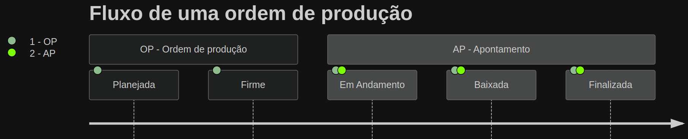

# Bem vindo ao  Manufatura 4.0

Apresentação slides para desenvolvedores

  
    Precione barra de espaço <carbon:arrow-right class="inline"/>
  

  <button @click="$slidev.nav.openInEditor()" title="Open in Editor" class="text-xl slidev-icon-btn opacity-50 !border-none !hover:text-white">
    <carbon:edit />
  </button>
  <a href="https://github.com/slidevjs/slidev" target="_blank" alt="GitHub" title="Open in GitHub"
    class="text-xl slidev-icon-btn opacity-50 !border-none !hover:text-white">
    <carbon-logo-github />
  </a>

<!--
O último bloco de comentários de cada slide será tratado como notas do slide. Ele ficará visível e editável no Modo Apresentador junto com o slide. [Leia mais na documentação](https://sli.dev/guide/syntax.html#notes)
-->

---
transition: fade-out
---

# Módulos do manufatura 4.0

O manufatura 4.0 é composto por 4 módulos:

 ---
  

- **<carbon-settings/> Parâmetros Globais** - Configurações globais que serão utilizadas por todos os módulos
- **<ic-baseline-engineering/> Engenharia de produtos** - Configuração de produtos e suas variantes 
- **<fluent-production-24-regular/> Controle de produção** - Criação, controle e apontamento de ordens de produção
- **<fluent-production-checkmark-24-regular/> Controle de Formulários** - Controle de formulários para ordem de produção e controle de qualidade

<!--
You can have `style` tag in markdown to override the style for the current page.
Learn more: https://sli.dev/guide/syntax#embedded-styles
-->

<!--
Here is another comment.
-->

---
layout: default
---

# <carbon-settings/> Parâmetros Globais

Configurações globais que serão utilizadas por todos os módulos

 ---
  
---
transition: slide-up
level: 2
---

# <ic-baseline-engineering/> Engenharia de produtos

Configuração de produtos e suas variantes

 
  ---
 

- Linha de produção
- Recursos
- Ferramentas
- Lista de materiais
- Roteiro de operações

---

# <fluent-production-24-regular/> Controle de produção

Criação, controle e apontamento de ordens de produção

 ---
  

- Criação de ordem de produção
- Consumo da engenharia de produtos e suas proporções
- Apontamento de ordem de produção
- Status de ordem de produção
- Rastreabilidade de ordem de produção

<!--
Fazendo as anotações do apresentador
-->

---

# <fluent-production-checkmark-24-regular/> Controle de Formulários

Controle de formulários para ordem de produção e controle de qualidade

 ---
  

- Criação de multiplos formulários a partir de uma ordem de produção
- Criação de formulários manualmente 
- Rastreabilidade de formulários pelas ordens de produção
- Fila de inspeção para os formulários
- Controle supervisionado de formulários
- Apontamento de produção com formulários

<!--
Presenter note with **bold**, *italic*, and ~~striked~~ text.

Also, HTML elements are valid:

  Left content
  Right content

-->

---
clicks: 5
---

# Diagramas

  Ordem de Produção
  <DialogBox v-click class="flex-auto">
    Planejada
  </DialogBox>

  <DialogBox v-click class="flex-auto">
    Firme
  </DialogBox>

  <DialogBox v-click class="flex-auto">
    Em Andamento
  </DialogBox>

  <DialogBox v-click class="flex-auto">
    Baixado
  </DialogBox>

  <DialogBox v-click class="flex-auto">
    Finalizado
  </DialogBox>

  
  
   
  
  --- 

 Apontamento de Produção

  

  <DialogBox v-click="[2,6]" class="flex-auto bg-gray-500">
    Firme
  </DialogBox>
 
  <DialogBox v-click="[3,6]" class="flex-auto bg-gray-500">
    Em Andamento
  </DialogBox>

  <DialogBox v-click="[4,6]" class="flex-auto bg-gray-500">
    Baixado
  </DialogBox>

  <DialogBox v-click="[5,6]" class="flex-auto bg-gray-500">
    Finalizado
  </DialogBox>

 
  
  --- 

 Estoque

  
 
  <DialogBox v-click="[5,6]" class="flex-initial w-33 bg-gray-300 text-gray-900 ">
    Finalizado
  </DialogBox>

---

# Diagramas

<v-clicks>

1. Criação de ordem de produção como Planejada
2. Firma a ordem de produção para que seja possível apontar
3. Inicia apontamento da ordem de produção muda status para Em Andamento
4. Apontamento parcial da ordem de produção muda status para Baixada
5. 100% apontamento da ordem de produção muda status para Finalizada

</v-clicks>
 

> A ordem de produção só pode ser apontada se estiver no status Firme

 

---
preload: false
---

# Agradecimentos 

- Mauricio Costa
- Osnir Alves
- Rafael Correa
- Gustavo Silva
- Diogo Bento

  

    
    
    
  

  

    Slidev
  

<!-- vue script setup scripts can be directly used in markdown, and will only affects current page -->

