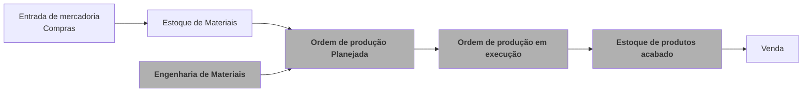
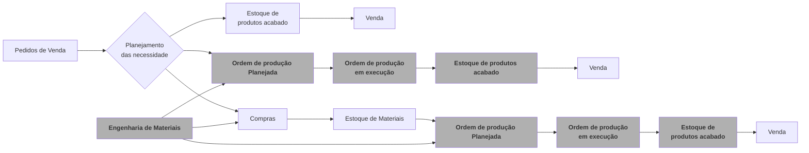
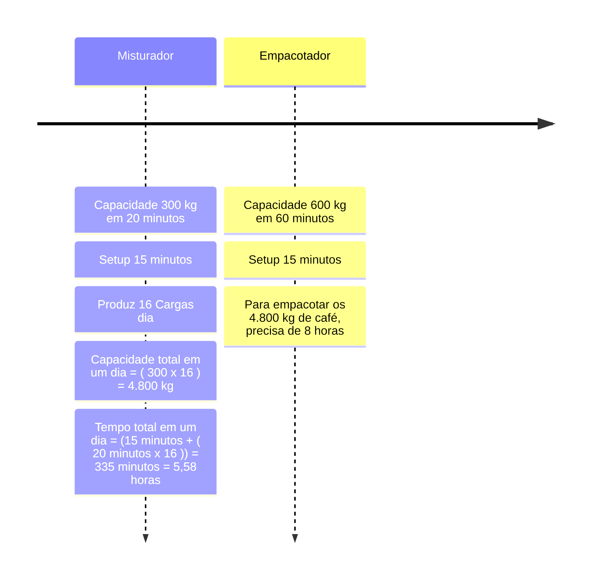

# Manufatura

Uma visão para Industria  

  
    Precione barra de espaço <carbon:arrow-right class="inline"/>
  

<!--
O último bloco de comentários de cada slide será tratado como notas do slide. Ele ficará visível e editável no Modo Apresentador junto com o slide. [Leia mais na documentação](https://sli.dev/guide/syntax.html#notes)
-->

---
transition: fade-out
---

# Módulos do manufatura 

O manufatura EME4 é composto por 4 módulos:

 ---
  

- **<carbon-settings/> Parâmetros Globais** - Configurações globais que serão utilizadas por todos os módulos
- **<ic-baseline-engineering/> Engenharia de produtos** - Configuração de produtos e suas variantes 
- **<fluent-production-24-regular/> Controle de produção** - Criação, controle e apontamento de ordens de produção
- **<fluent-production-checkmark-24-regular/> Controle de Formulários** - Desenvolvimento específico para  o Controle da Manufatura e Qualidade
- **<fluent-notebook-add-24-regular/> Custos** - Calculo do custo real do produto fabricado

<!--
You can have `style` tag in markdown to override the style for the current page.
Learn more: https://sli.dev/guide/syntax#embedded-styles
-->

<!--
Here is another comment.
-->
---
clicks: 2
mdc: true
---

#  <ic-baseline-engineering/> Tipos de Produção e a necessidade de materiais

Existem dois tipos de produção. A empurrada e a puxada ou o uso das duas de forma simultânea.

<h3 class="border-b-1" mb-2 > Produção empurrada </h3>

 

<h3 class="border-b-1" mb-2 > Produção puxada </h3>

---

#  <ic-baseline-engineering/> A Engenharia e a Capacidade de Produção
Linha de produção para o  Café Cappuccino ☕

---

# A Manufatura do Queijo Minas Frescal
Resolvendo a Lista de Material e Roteiro de Produção

{width=150px lazy}

  

 | ITEM | QUANTIDADE PAI (EM LITROS) | QUANTIDADE FILHO |
 | --- | --- | --- |
 | Leite vaca in natura padrão | 10 | 100 litros |
 | Sal ref extra cisne 25kg ind(vermelho) | 10 | 1.000 g |
 | Cloreto de calcio | 10 | 300 ml |
 | Fermento dvs tcc 20 500u congelado | 10 | 1.000 ml |
 | Chy max extra bb 5 litros (coagulante) | 10 | 60 ml |
 | Pote ( prt 530 ) - leve | 10 | 20 un |
 | Pote vita 500g - minas frescal tradicional ( PRT 530 ) | 10 | 20 un |
 | Tampa vita 500g - minas frescal trad (imp) (st 125) (st 130) | 10 | 20 un |
 | Saco vita/eur 20 x 35 - minas frescal pote (bobina) (liso) | 10 | 20 un |
 | Saco vita/eur 20 x 35 - minas frescal pote (bobina) (liso) | 10 | 20 un |
 | Cx vita - nº 15 - 06 pt - 500g | 10 | 3 un |
 | Fita adesiva 12mmx120m branca (embalar queijo) - 50 microns | 10 | 3 metros |

 

|ROTEIRO DE PRODUÇÃO|TEMPO|
|--|--|
|Mistura Fermento Lácteo (DVS) | 30 minutos |
|Mistura Cloreto de Calcio e Coagulação| 45 minutos |
|Corte da Coalhada com a Lira| 10 minutos |
|Mexedura| 20 minutos |
|Salga| 10 minutos |
|Formas de Minas Frescal | 60 minutos |
|Embalagem| 15 minutos |

Observação: Na lista de material podem ser adicionados itens Alternativos, geralmente substitutos para os itens da lista caso faltem.

---

# <carbon-settings/> Parâmetros Globais

Configurações globais que serão utilizadas por todos os módulos

 ---
  

 - Parâmetros Filiais Manufatura
 - Calendário de produção
 - Turnos de produção
---
transition: slide-up
level: 2
---

# <ic-baseline-engineering/> Engenharia de produtos

Configuração de produtos e suas variantes

 
  ---
 

- Linha de produção
- Recursos
- Ferramentas
- Lista de materiais (BOM) Versionadas (Preferencia, Alternativa, opcional, Co-produto, Sub-Produto)
- Roteiro de operações (Routing) Versionadas

---

# <fluent-production-24-regular/> Controle de produção

Criação, controle e apontamento de ordens de produção

 ---
  

- Criação de ordem de produção ( Empurrada, Puxada ou Mista) 
- Consumo da engenharia de produtos e suas proporções
- Uma ordem para multiplos produtos saída (Co-produtos)
- Ordens de produção Planejadas, Firmes, Em Andamento, Baixa Parcial e Finalizada
- Apontamento de ordem de produção (Parcial e Total) - Opcionalmente com formulários Web
- Rastreabilidade de ordem de produção

<!--
Fazendo as anotações do apresentador
-->

---
clicks: 6
mdc: true
---

# Diagrama da Ordem de Produção
Situações da Ordem de produção por etapas

  

    
 Etapas 

  

  Ordem de Produção
  <DialogBox v-click class="flex-auto">
    Planejada
  </DialogBox>

  <DialogBox v-click class="flex-auto">
    Firme
  </DialogBox>

  <DialogBox v-click class="flex-auto">
    Em Andamento
  </DialogBox>

  <DialogBox v-click class="flex-auto">
    Baixa parcial
  </DialogBox>

  <DialogBox v-click class="flex-auto">
    Finalizada
  </DialogBox>

  <DialogBox v-click class="flex-auto">
    Concluída
  </DialogBox>

  
  

  

 Apontamento de Produção

  

  <DialogBox v-click="[2,7]" class="flex-auto bg-gray-500">
    Firme
  </DialogBox>
 
  <DialogBox v-click="[3,7]" class="flex-auto bg-gray-500">
    Em Andamento
  </DialogBox>

  <DialogBox v-click="[4,7]" class="flex-auto bg-gray-500">
    Baixa Parcial
  </DialogBox>

  <DialogBox v-click="[5,7]" class="flex-auto bg-gray-500">
    Finalizada
  </DialogBox>

  <DialogBox v-click="[6,7]" class="flex-auto bg-gray-500">
    Concluída
  </DialogBox>

  

 Estoque

  
  <DialogBox v-click="[4,7]" class="w-28" bg="gray-600 dark:gray-300" text="gray-300 dark:gray-600">
    Baixa Parcial
  </DialogBox>

  <DialogBox v-click="[5,7]" class=" w-23" bg="gray-600 dark:gray-300" text="gray-300 dark:gray-600">
    Finalizada
  </DialogBox>

  <DialogBox v-click="[6,7]" class=" w-21" bg="gray-600 dark:gray-300" text="gray-300 dark:gray-600">
    Concluída
  </DialogBox>

 Custos

  <DialogBox v-click="[6,7]" class=" w-21" bg="gray-800 dark:gray-300" text="gray-300 dark:gray-800">
    Concluído
  </DialogBox>

  <table mt-2>
  <tr border-t-1>
    <th border-r-1 >Situação</th>
    <th>Descrição</th>
  </tr>
  <tr border-t-1>
    <td class="border-r-1"> 
 Planejada 
 </td>
    <td v-click="1" > A Ordem de Produção foi criada e esta na situação de Planejamento.</td>
  </tr>
  <tr class="">
    <td border-r-1> 
 Firme 
 </td>
    <td v-click="2" >O produto e a quantidade da Ordem é Firmada e esta pronta para receber os apontamentos.</td>
  </tr>
  <tr>
    <td border-r-1> 
 Em Andamento 
 </td>
    <td v-click="3" > A Ordem já tem apontamento.</td>
  </tr>
  <tr>
    <td border-r-1> 
 Baixa Parcial 
 </td>
    <td v-click="4" > A Ordem já tem apontamento integrado no Estoque.</td>
  </tr>
  <tr>
    <td border-r-1 > 
 Finalizada 
 </td>
    <td v-click="5" > A Ordem foi 100% apontada e integrada Estoque.</td>
  </tr>
  <tr>
    <td border-r-1> 
 Concluído 
 </td>
    <td v-click="6" > A Ordem foi Custeada o o produto fabricado valorizado.</td>
  </tr>
  </table>

---

# <fluent-production-checkmark-24-regular/> Controle de Formulários

Controle de formulários para ordem de produção e controle de qualidade

 ---
  

- Criação de multiplos formulários a partir de uma ordem de produção
- Criação de formulários manualmente 
- Rastreabilidade de formulários pelas ordens de produção
- Fila de inspeção para os formulários
- Controle supervisionado de formulários
- Apontamento de produção com formulários

<!--
Presenter note with **bold**, *italic*, and ~~striked~~ text.

Also, HTML elements are valid:

  Left content
  Right content

-->

---
clicks: 3
mdc: true
---

# <fluent-production-checkmark-24-regular/> Formulários WEB
Resolvendo apontamentos de produção e de controle de qualidade

?? Incluir imagem de celular

---

# Estoques

---

# <fluent-notebook-add-24-regular/> Custos
Calculo dos custos mensais de produção para produto acabado, semi acabado e recursos

- Parametrização do módulo de Custos
- Calculo dos custos mensais de produção para produto acabado, semi acabado e recursos
  - Checagem dos parametros
  - Calculo dos custos
  - Atualização Estoques (Entradas/Estornos de Produção) e Custo médio mensal
  - Atualização/Reintegração da Contabilidade

---
clicks: 4
mdc: true
---

# <fluent-notebook-add-24-regular/> Custos 
Uma Visão da apuração do custo mensal

---

# Documentação

- [Documentação](https://docs.datainfo.inf.br/eme4-manufatura/)

---
preload: false
layout: image
image: ./EME4_FUNDO_FIM2.png
---

# Contato 

